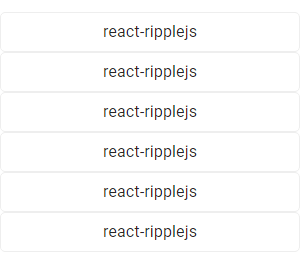

# react-ripplejs

Adds Material Design-style feedback ripples to your existing HTML (React components?) without any dependencies. Implemented from [samthor](https://github.com/samthor)'s [rippleJS](https://github.com/samthor/rippleJS) for ReactJS

## Demo

[See the live demo here](https://michioxd.github.io/react-ripplejs/)



## Requirements

`'react': ^18.0.0`

## Install

Install this package with your favorite package manager

```bash
# npm
npm i react-ripplejs

# pnpm
pnpm i react-ripplejs

# yarn
yarn add react-ripplejs
```

## Usage

```tsx
import Ripple from "react-ripplejs";

const App = () => (
  <Ripple
    fill={false} // boolean?, default: false
    opacity={""} // string?, default: ""
    background={""} // string?, default: ""
  >
    Somthing here brrr
  </Ripple>
);

export default App;
```

### fill

#### `boolean?`

Fill ripple to rounded corners, good for form elements with fixed size.

Default: `false`

### opacity

#### `string?`

Ripple Opacity, example: `0.1`

Default: (empty)

### background

#### `string?`

Ripple Background, example: `red`

Default: (empty)

## License

[MIT License](./LICENSE)

## Credits

React implement by [michioxd](https://github.com/michioxd). Inspired by [samthor](https://github.com/samthor)
